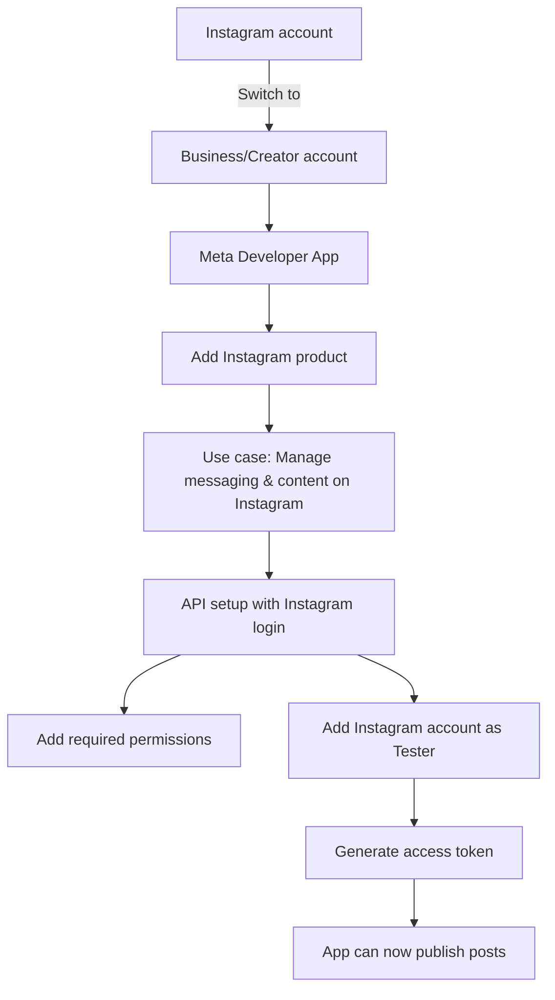
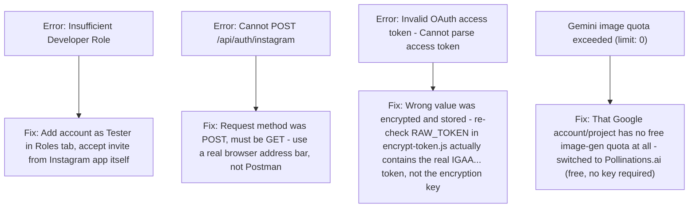
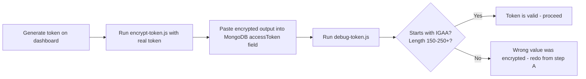

# Meta Developer Dashboard — Instagram Setup Guide

Reference doc for setting up (or re-setting up) the Instagram API side of this project. Written from the exact steps that worked, including the real errors hit along the way and how they were fixed.

---

## 1. Overview: What We're Setting Up

This project uses **Instagram API with Instagram Login** — no Facebook Page required, no Facebook Login flow. Just a Meta Developer App configured for direct Instagram authentication.



---

## 2. Step-by-Step Setup

### Step 1: Create the Meta App

1. Go to **developers.facebook.com**
2. Click **Get Started** → log in → accept terms
3. Click **Create App**
4. Choose any use case (e.g. "Other")
5. Name it anything (e.g. "Reality_world")
6. Click **Create App**

### Step 2: Add the correct use case

⚠️ Don't let it auto-add "Facebook Login for Business" or "Messenger" — those aren't needed.

1. On the Dashboard, click **"Add use cases"**
2. Filter by **All**, scroll to find **"Manage messaging & content on Instagram"**
3. Check it, click **Save**

### Step 3: Go to Instagram API setup

1. Left sidebar → **Instagram API** → click **"API setup with Instagram login"**
   - ⚠️ NOT "API setup with Facebook login" — that's the old Page-based path
2. This page shows your **Instagram App ID** and **Instagram App Secret** — copy both into `.env`:
   ```
   INSTAGRAM_APP_ID=...
   INSTAGRAM_APP_SECRET=...
   ```

### Step 4: Add required permissions

Under **"1. Add required messaging permissions"**, click **"Add all required permissions"**. This adds:

- `instagram_business_basic`
- `instagram_business_manage_comments`
- `instagram_business_manage_messages`

### Step 5: Add your Instagram account as a Tester

While the app is in **Development mode**, only accounts explicitly added as testers can connect.

1. Left sidebar → **App roles → Roles**
2. Add your Instagram account (by username) as an **Instagram Tester**
3. Open the **Instagram app** on your phone → **Settings → Apps and websites → Tester invites**
4. **Accept** the invite

### Step 6: Generate an access token (manual/quick-test path)

Back on **"API setup with Instagram login"**, under **"2. Generate access tokens"**:

1. Your tester accounts appear in a list, each with their **Instagram User ID** shown underneath the username
2. Click **"Generate token"** next to the account you want to post to
3. Approve the popup
4. Copy the token shown — **treat this exactly like a password, never share it anywhere**

### Step 7 (for the real app, not just testing): Set up Instagram business login

Under **"4. Set up Instagram business login"**, click **Set up**, and enter your OAuth redirect URI:

```
http://localhost:5000/api/auth/instagram/callback
```

This must match `INSTAGRAM_REDIRECT_URI` in `.env` exactly.

---

## 3. Errors Actually Hit — and Fixes



| Error                                                      | Cause                                                                         | Fix                                                                                                     |
| ---------------------------------------------------------- | ----------------------------------------------------------------------------- | ------------------------------------------------------------------------------------------------------- |
| `Insufficient Developer Role`                            | Instagram account not added as a Tester yet                                   | Add via Roles tab, accept invite from Instagram app                                                     |
| `Cannot POST /api/auth/instagram`                        | Postman method dropdown stuck on POST                                         | Use GET — easiest via a real browser address bar                                                       |
| `Invalid OAuth access token - Cannot parse access token` | Wrong value (the encryption key, not the real token) got encrypted and stored | Carefully replace`RAW_TOKEN` in `encrypt-token.js` with the actual `IGAA...` token before running |
| Gemini`Quota exceeded... limit: 0`                       | That specific Google Cloud project has zero free-tier image generation quota  | Switched image generation to Pollinations.ai instead of Gemini                                          |

---

## 4. Token Verification Checklist

Whenever a real Instagram token is generated and stored, verify it before trusting it:



A correctly stored token, when decrypted, should:

- Start with **`IGAA`**
- Be roughly **150-250+ characters** long

If it's exactly **64 characters** and doesn't start with `IGAA` — that's the `TOKEN_ENCRYPTION_KEY` accidentally getting encrypted instead of the real token (this happened twice during setup — easy mistake to repeat).

---

## 5. Quick Reference: Key URLs

| What                                   | URL                                                                         |
| -------------------------------------- | --------------------------------------------------------------------------- |
| Meta App Dashboard                     | developers.facebook.com                                                     |
| API setup with Instagram login         | Left sidebar inside your app → Instagram → API setup with Instagram login |
| Instagram Tester invites (on phone)    | Instagram app → Settings → Apps and websites → Tester invites            |
| Real OAuth connect flow (browser only) | `http://localhost:5000/api/auth/instagram`                                |

---

## 6. If You Get Stuck Again

1. Check which stage failed: `image_generation`, `media_container`, `media_publish`, etc. — the error response always tells you the `stage`
2. If it's Instagram-related → run `debug-token.js` first, confirm the stored token is valid
3. If it's Gemini-related → check if it's the caption model or image model failing, confirm free-tier quota isn't the issue
4. If it's a fresh "Insufficient Role" type error → the tester invite likely needs re-accepting, or the app needs re-adding as a tester
