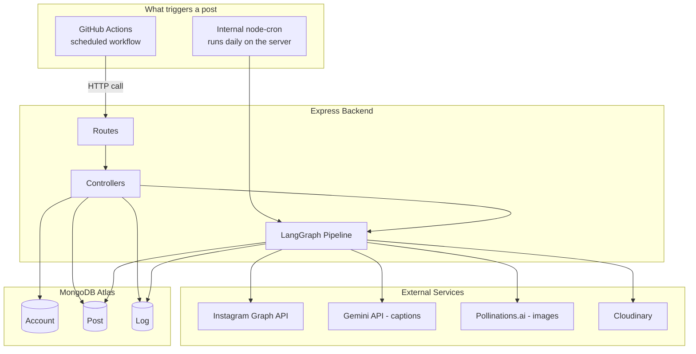
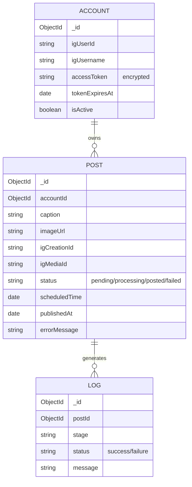
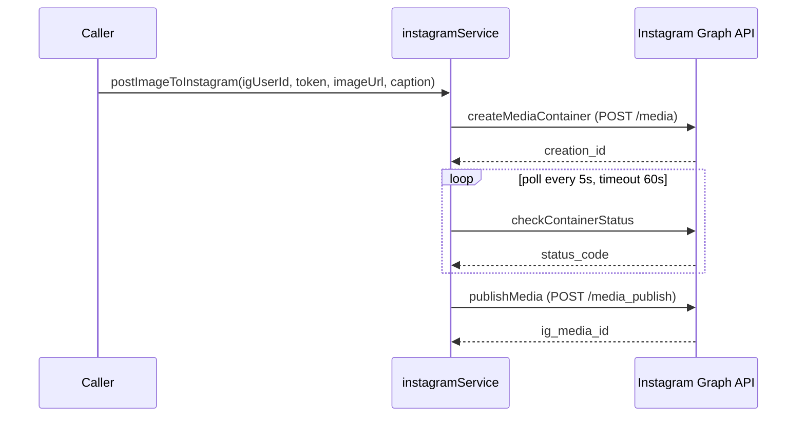
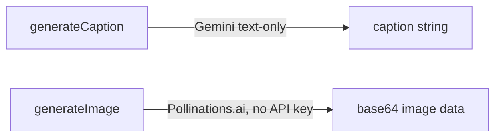
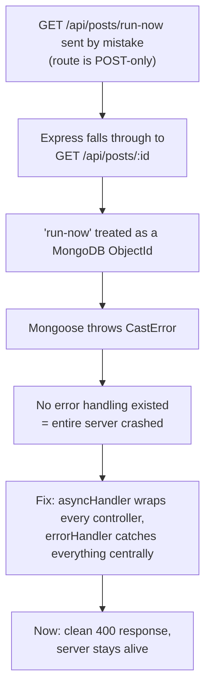
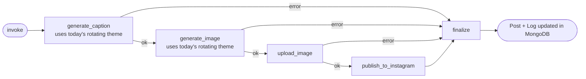
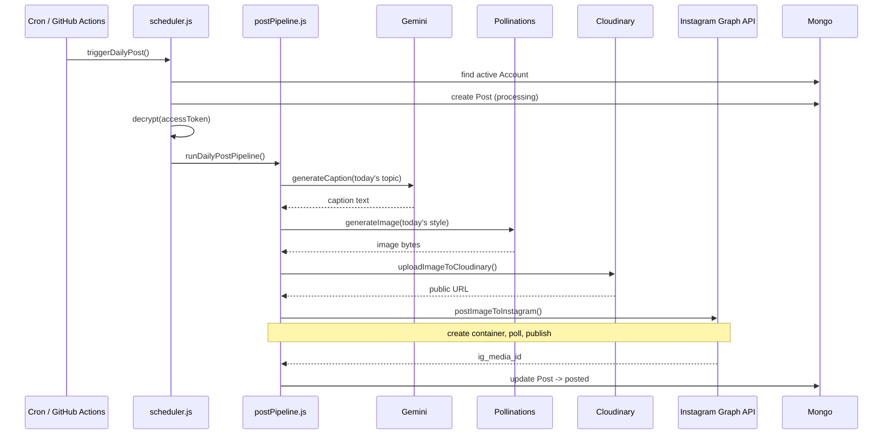
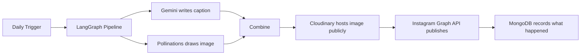

# IG Auto Poster — Full Project Documentation

This covers everything currently built in this project: every folder, every file, what each function does, and how it all connects. Written so you can understand your own vibe-coded app end to end.

---

## 1. What This App Does, In One Sentence

Every day, a scheduler triggers a pipeline that generates a caption (Gemini) and an image (Pollinations.ai), uploads the image to Cloudinary, and publishes the result to your Instagram account via the Instagram Graph API — fully automated, no manual steps.

---

## 2. Folder Structure

```
Insta_automataion/
├── .github/workflows/
│   ├── daily-post.yml              (Option A: run pipeline inside GitHub Actions)
│   └── daily-post-via-server.yml   (Option B: call the deployed server's route)
├── scripts/
│   └── run-daily-post.js           (standalone script used by Option A)
├── src/
│   ├── config/
│   ├── controllers/
│   ├── cron/
│   ├── graph/
│   ├── models/
│   ├── routes/
│   ├── services/
│   ├── utils/
│   └── server.js
├── .env
└── package.json
```

**Layer roles:**

- **`config/`** — loads environment variables, grouped by external service
- **`models/`** — MongoDB schemas
- **`services/`** — talk to external APIs (Instagram, Gemini, Pollinations, Cloudinary) — no Express involved
- **`controllers/`** — handle requests, call services, talk to models
- **`routes/`** — map URL paths to controller functions, nothing else
- **`graph/`** — the LangGraph pipeline that runs services in sequence
- **`cron/`** — scheduled jobs
- **`utils/`** — standalone helpers (encryption, error handling, prompt rotation)

---

## 3. High-Level Architecture



---

## 4. Config Layer (`src/config/`)

| File              | What it holds                                                              |
| ----------------- | -------------------------------------------------------------------------- |
| `db.js`         | `connectDB()` — connects Mongoose to `MONGO_URI`                      |
| `instagram.js`  | Instagram Login API URLs +`INSTAGRAM_APP_ID`/`SECRET`/`REDIRECT_URI` |
| `gemini.js`     | Gemini API URL, key, and`TEXT_MODEL` (captions only now)                 |
| `cloudinary.js` | Configured Cloudinary SDK instance                                         |

Note: there's no `pollinations.js` config file — Pollinations.ai needs no API key, so `aiService.js` calls it directly with a hardcoded base URL.

---

## 5. Data Models (`src/models/`)



This app supports **one active account at a time** — `scheduler.js` always grabs `Account.findOne({ isActive: true })`. It's a personal automation tool, not multi-user.

---

## 6. Services (`src/services/`) — talk to the outside world

### `instagramService.js`

Handles the actual publish flow to Instagram.



| Function                    | Purpose                                                                          |
| --------------------------- | -------------------------------------------------------------------------------- |
| `createMediaContainer()`  | Sends image URL + caption, gets a`creationId` back                             |
| `checkContainerStatus()`  | Checks if Instagram finished processing (`IN_PROGRESS`/`FINISHED`/`ERROR`) |
| `waitForContainerReady()` | Polls until ready or times out                                                   |
| `publishMedia()`          | Publishes using the`creationId`                                                |
| `postImageToInstagram()`  | Runs all steps in order — the one function everything else calls                |

### `instagramAuthService.js`

Handles the OAuth login flow (Instagram Login, no Facebook Page).

| Function                             | Purpose                                                         |
| ------------------------------------ | --------------------------------------------------------------- |
| `exchangeCodeForShortLivedToken()` | Trades the OAuth`code` for a short-lived token + `igUserId` |
| `exchangeForLongLivedToken()`      | Upgrades to a 60-day token                                      |
| `refreshLongLivedToken()`          | Renews a token before it expires                                |
| `completeInstagramConnection()`    | Runs the full connect flow                                      |

### `aiService.js`

Content generation — **captions via Gemini, images via Pollinations.ai**.



| Function                         | Purpose                                                                                                       |
| -------------------------------- | ------------------------------------------------------------------------------------------------------------- |
| `generateCaption(topicPrompt)` | Calls Gemini's text model                                                                                     |
| `generateImage(imagePrompt)`   | Calls`image.pollinations.ai` — free, no key, switched from Gemini after hitting zero free-tier image quota |

### `uploadService.js`

| Function                      | Purpose                                                                      |
| ----------------------------- | ---------------------------------------------------------------------------- |
| `uploadImageToCloudinary()` | Converts base64 image → public Cloudinary URL (required by Instagram's API) |

---

## 7. Utils (`src/utils/`)

| File                  | Purpose                                                                                                                                |
| --------------------- | -------------------------------------------------------------------------------------------------------------------------------------- |
| `encryption.js`     | AES-256-GCM`encrypt()`/`decrypt()` for the access token at rest in MongoDB                                                         |
| `promptRotation.js` | `getDailyPrompt()` — cycles through 7 themes based on day-of-year, so caption topic + image style change daily instead of repeating |
| `asyncHandler.js`   | Wraps async controllers so errors don't crash the whole server                                                                         |
| `errorHandler.js`   | Global Express error middleware — catches anything`asyncHandler` passes along, returns clean JSON instead of crashing               |

### Why `asyncHandler` + `errorHandler` exist (a real bug that happened)



---

## 8. Controllers (`src/controllers/`)

| File                     | Function                                            | Purpose                                                                                 |
| ------------------------ | --------------------------------------------------- | --------------------------------------------------------------------------------------- |
| `authController.js`    | `redirectToInstagramAuth`                         | Redirects to Instagram's OAuth screen                                                   |
|                          | `handleInstagramCallback`                         | Handles the redirect, encrypts token, upserts`Account`                                |
| `postController.js`    | `runNow`                                          | Manually triggers the pipeline —**protected by `TRIGGER_SECRET` header check** |
|                          | `listPosts` / `getPostById` / `deletePost`    | Post history management                                                                 |
| `accountController.js` | `getAccountStatus`                                | Connection status, never exposes raw token                                              |
| `tokenController.js`   | `refreshAccountToken` / `refreshExpiringTokens` | Renews tokens within a 10-day expiry window                                             |

---

## 9. Routes (`src/routes/`)

All routes are wrapped in `asyncHandler`.

| Method | Path                             | Notes                               |
| ------ | -------------------------------- | ----------------------------------- |
| GET    | `/api/auth/instagram`          | Start OAuth                         |
| GET    | `/api/auth/instagram/callback` | OAuth redirect target               |
| POST   | `/api/posts/run-now`           | Requires`x-trigger-secret` header |
| GET    | `/api/posts`                   | List history                        |
| GET    | `/api/posts/:id`               | Single post + logs                  |
| DELETE | `/api/posts/:id`               | Delete a post record                |
| GET    | `/api/account`                 | Connection status                   |
| GET    | `/api/health`                  | Alive check                         |

---

## 10. The LangGraph Pipeline (`src/graph/postPipeline.js`)



State is defined with **Zod**. Every node writes a `Log` entry. Any node's failure short-circuits straight to `finalize`, which marks the `Post` as `failed` with the error, or `posted` with the live `igMediaId`.

---

## 11. Scheduling — Three Ways This Can Run

```mermaid
flowchart TB
    subgraph A["Option A: Internal cron (always on)"]
        A1[node-cron inside server.js] --> A2[Fires daily at 9 AM server time]
        A2 --> A3[Only works if server is awake at that moment]
    end
    subgraph B["Option B: GitHub Actions - direct"]
        B1[.github/workflows/daily-post.yml] --> B2[Runs scripts/run-daily-post.js<br/>in a fresh GitHub runner]
        B2 --> B3[Connects to MongoDB Atlas directly,<br/>no server needed at all]
    end
    subgraph C["Option C: GitHub Actions - via server"]
        C1[.github/workflows/daily-post-via-server.yml] --> C2[curl POST to deployed Render URL<br/>with x-trigger-secret header]
        C2 --> C3[Server's runNow controller handles it]
    end
```



**Only one of B or C should be active at a time** to avoid double-posting. Option A (internal cron) is a natural backup but also risks double-posting if the server happens to be awake at the same time as the GitHub Actions trigger.

---

## 12. Full End-to-End Sequence (real request)



---

## 13. Security Notes

- **Access tokens** are AES-256-GCM encrypted at rest — never stored as plain text
- **`POST /api/posts/run-now`** requires a matching `x-trigger-secret` header — prevents random internet traffic from spamming your Instagram
- **All routes wrapped in `asyncHandler`** — one bad request can't crash the whole server anymore
- **Single-account app** — no user login system exists; this is intentionally a personal tool, not multi-tenant

---

## 14. Debug/Test Scripts (root level, not part of the real app)

| File                  | Purpose                                                |
| --------------------- | ------------------------------------------------------ |
| `encrypt-token.js`  | Manually encrypts a raw token for pasting into MongoDB |
| `debug-token.js`    | Verifies a stored token decrypts correctly             |
| `test-real-post.js` | Publishes one test post bypassing the DB entirely      |

These are debugging aids, not part of the production app — safe to delete once everything is stable, but harmless to keep as long as no real tokens are left inside them.

---

## 15. Quick Mental Model (the whole app in one picture)


