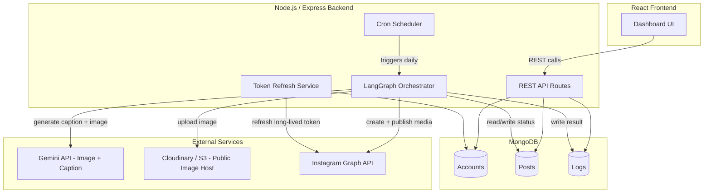
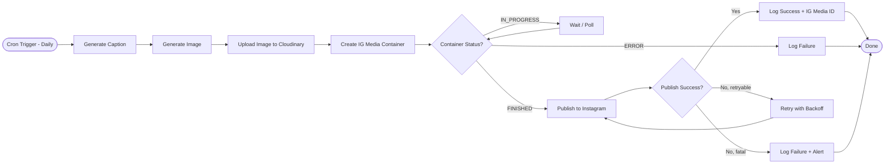
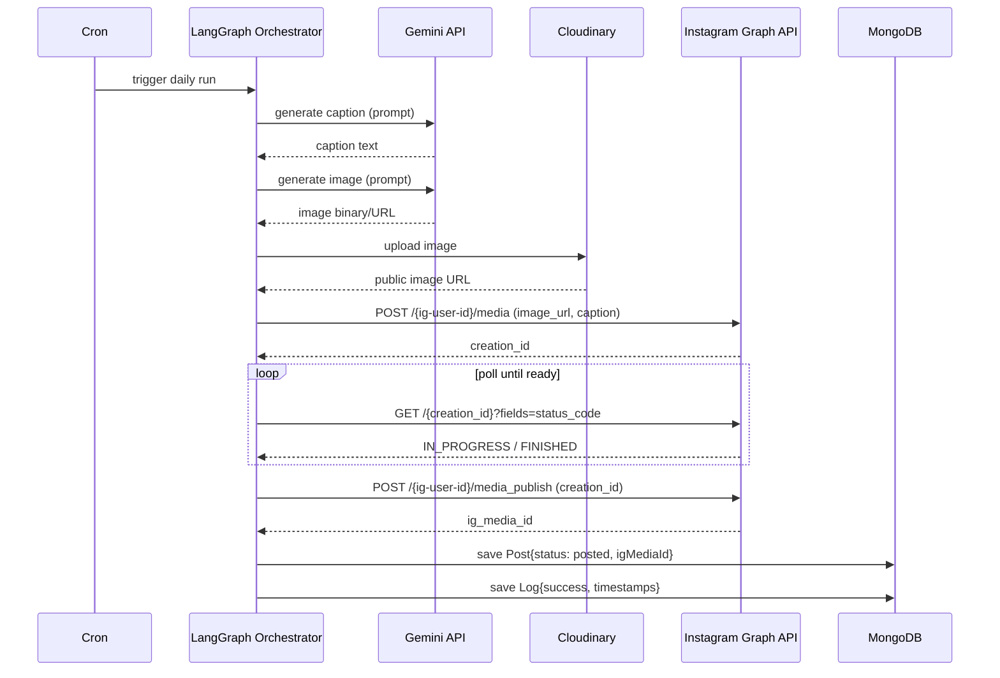
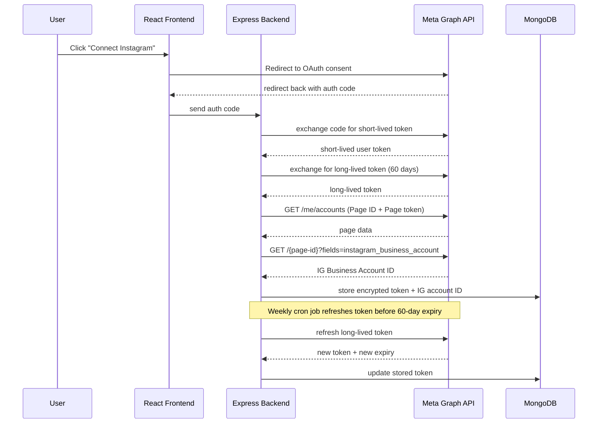
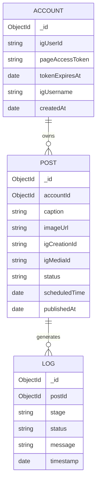
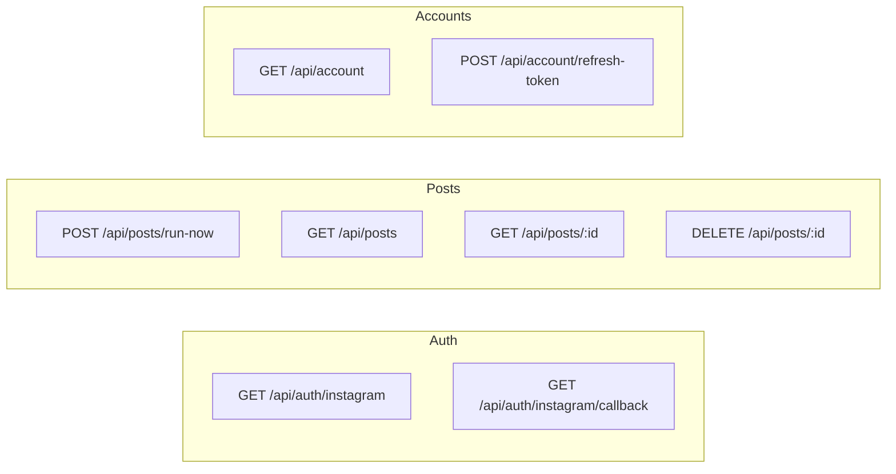
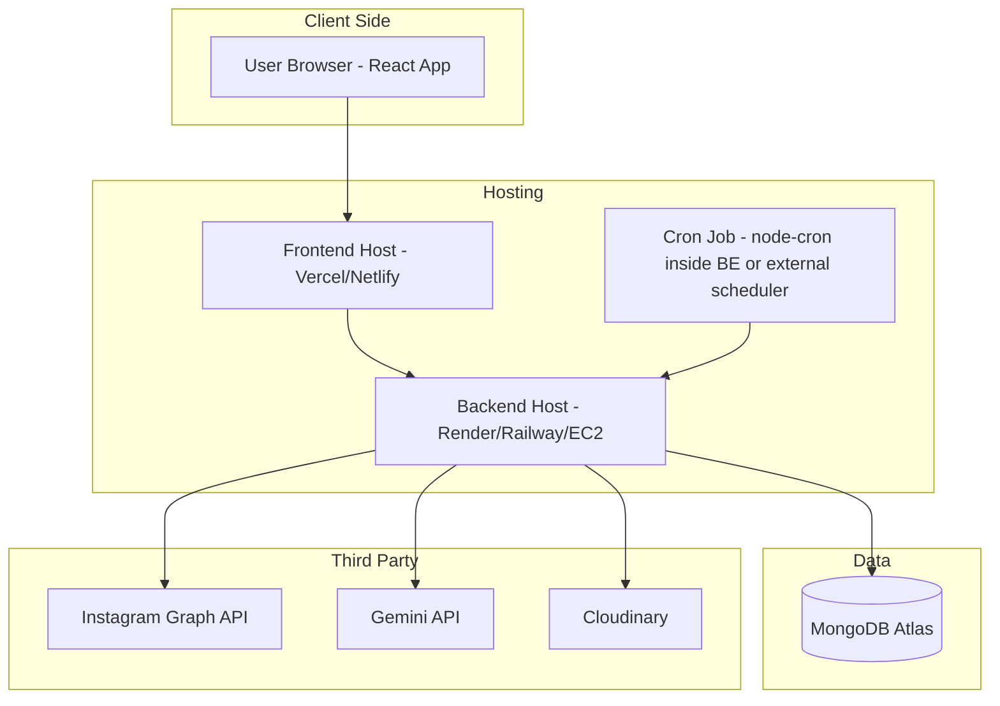

# Automated Instagram Daily Poster — System Design

## 1. Overview

A MERN-based system that automatically generates an AI image + caption every day and publishes it to a single Instagram Business account, orchestrated via LangGraph and scheduled via a cron job.

**Stack**
- **Frontend**: React (dashboard — view/manage scheduled & posted content, connect IG account)
- **Backend**: Node.js + Express (API routes, orchestration trigger, token management)
- **Database**: MongoDB (accounts, posts, logs)
- **Orchestration**: LangGraph (AI generation + publish pipeline as a graph of nodes)
- **Storage**: Cloudinary/S3 (public image hosting, required by Instagram API)
- **External APIs**: Instagram Graph API (Meta), Gemini API (image + caption generation)
- **Scheduler**: node-cron / Agenda.js

---

## 2. High-Level Architecture

---

## 3. LangGraph Pipeline (Node Flow)

---

## 4. Sequence Diagram — End-to-End Daily Post

---

## 5. Instagram OAuth / Token Setup Flow (one-time + refresh)

---

## 6. Data Model (ER Diagram)

---

## 7. MongoDB Collections (Schema Summary)

**accounts**
| Field | Type | Notes |
|---|---|---|
| igUserId | String | Instagram Business Account ID |
| pageAccessToken | String (encrypted) | AES-encrypted at rest |
| tokenExpiresAt | Date | Used by refresh cron |
| igUsername | String | Display only |

**posts**
| Field | Type | Notes |
|---|---|---|
| accountId | ObjectId (ref Account) | |
| caption | String | AI-generated |
| imageUrl | String | Cloudinary public URL |
| igCreationId | String | From media container step |
| igMediaId | String | Final published media ID |
| status | Enum | `pending / processing / posted / failed` |
| scheduledTime | Date | When cron should run it |
| publishedAt | Date | Set on success |

**logs**
| Field | Type | Notes |
|---|---|---|
| postId | ObjectId (ref Post) | |
| stage | String | e.g. `caption_gen`, `image_gen`, `publish` |
| status | Enum | `success / failure` |
| message | String | Error detail or confirmation |

---

## 8. REST API Routes

---

## 9. Failure Handling & Retry Strategy

| Failure Point | Strategy |
|---|---|
| Gemini image/caption generation fails | Retry 2x with backoff → fallback to template caption/stock image |
| Cloudinary upload fails | Retry 2x → fail run, log, alert |
| IG container stuck `IN_PROGRESS` | Poll every 5s, timeout after 60s → fail run |
| IG publish returns rate-limit error | Backoff + retry once after delay |
| Access token expired | Auto-refresh job runs before 60-day expiry; if refresh fails, alert to reconnect account manually |

---

## 10. Deployment View

---

## 11. Build Milestones

1. Meta App setup + manual test post via Postman (validate credentials work)
2. Express backend: MongoDB models + Instagram service (auth, media container, publish, polling)
3. AI service module: caption generation + image generation (standalone tested)
4. Cloudinary upload service
5. LangGraph pipeline wiring all nodes together with retry/error edges
6. Cron trigger for daily automated run
7. React dashboard: connect account, view post history/logs, manual "run now" trigger
8. Token refresh cron job