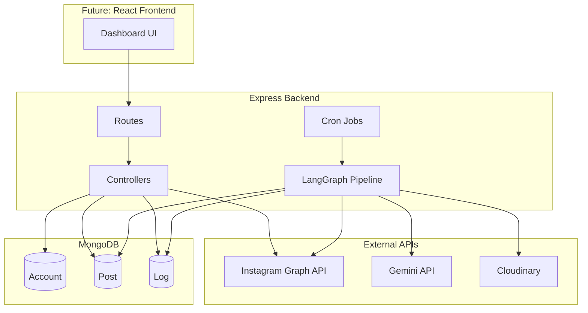
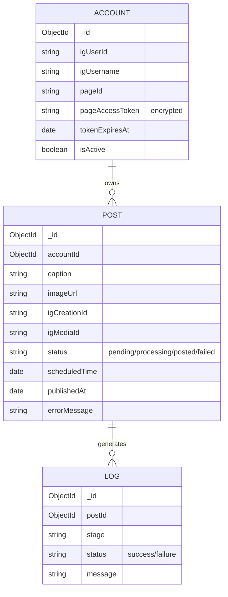
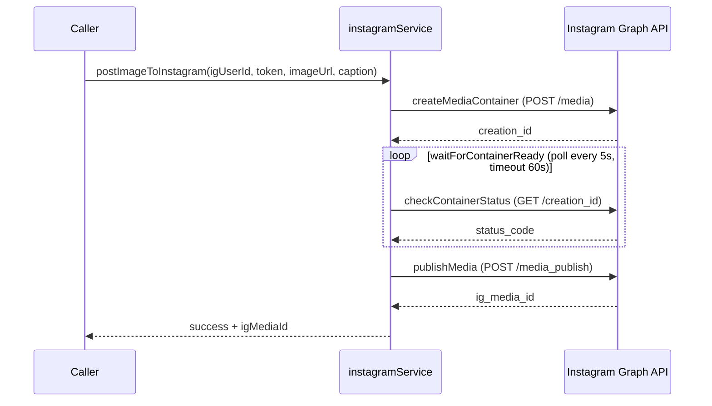
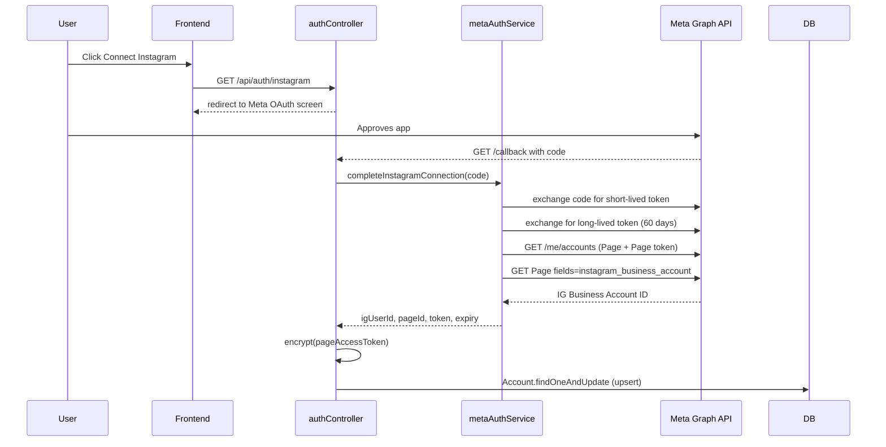
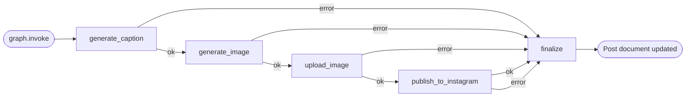
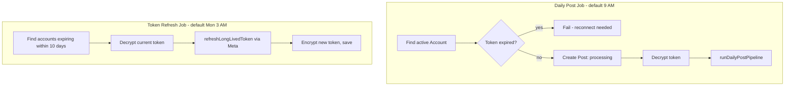
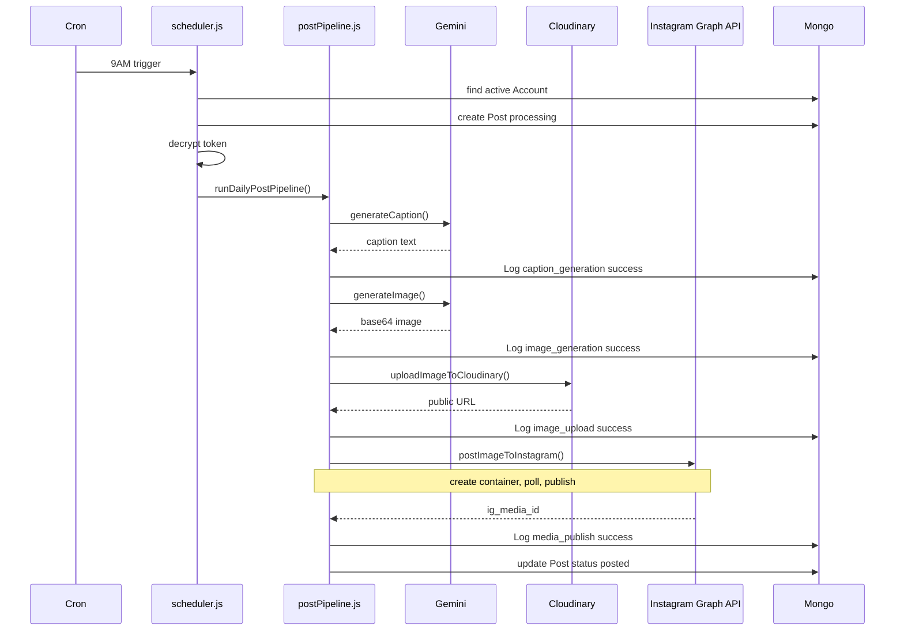

# Instagram Login Migration Update

Switched the backend auth layer from the old Facebook Page based Instagram Graph API flow to Instagram Login only.

Why:
- The app no longer depends on a Facebook Page.
- The connected account is now expected to be an Instagram Business or Creator account.

Breaking change:
- Legacy `Account` documents created with `pageId` and `pageAccessToken` are not compatible with the new schema.
- Delete those old account documents from MongoDB and reconnect the account through `GET /api/auth/instagram`.

Files touched in the migration:
- `src/config/instagram.js`
- `src/services/instagramAuthService.js`
- `src/services/instagramService.js`
- `src/controllers/authController.js`
- `src/controllers/tokenController.js`
- `src/models/Account.js`
- `src/cron/scheduler.js`
- `.env`
- `.env.example`

# IG Auto Poster — Backend Documentation

Complete reference of everything built so far: every file, what each function does, and how they connect.

---

## 1. Project Status

```
✅ Backend fully coded
🔲 Meta App setup (your manual part)
🔲 React frontend (not started)
🔲 End-to-end test with real credentials
```

---

## 2. Folder Structure

```
📦src
 ┣ 📂config
 ┃ ┣ 📜cloudinary.js
 ┃ ┣ 📜db.js
 ┃ ┣ 📜gemini.js
 ┃ ┗ 📜meta.js
 ┣ 📂controllers
 ┃ ┣ 📜accountController.js
 ┃ ┣ 📜authController.js
 ┃ ┣ 📜postController.js
 ┃ ┗ 📜tokenController.js
 ┣ 📂cron
 ┃ ┗ 📜scheduler.js
 ┣ 📂graph
 ┃ ┗ 📜postPipeline.js
 ┣ 📂models
 ┃ ┣ 📜Account.js
 ┃ ┣ 📜Log.js
 ┃ ┗ 📜Post.js
 ┣ 📂routes
 ┃ ┣ 📜accountRoutes.js
 ┃ ┣ 📜authRoutes.js
 ┃ ┗ 📜postRoutes.js
 ┣ 📂services
 ┃ ┣ 📜aiService.js
 ┃ ┣ 📜instagramService.js
 ┃ ┣ 📜metaAuthService.js
 ┃ ┗ 📜uploadService.js
 ┣ 📂utils
 ┃ ┗ 📜encryption.js
 ┣ 📜app.js
 ┗ 📜server.js
```

**Layer roles (MVC-style):**

- **`routes/`** — only maps `path → controller function`, zero logic
- **`controllers/`** — request/response handling, calls services, talks to models
- **`services/`** — talks to external APIs (Meta, Gemini, Cloudinary) — no Express, no DB
- **`models/`** — MongoDB schemas (Mongoose)
- **`graph/`** — LangGraph pipeline that orchestrates services in sequence
- **`cron/`** — scheduled jobs that trigger the pipeline / token refresh
- **`utils/`** — standalone helpers (encryption)
- **`config/`** — environment variable loading, grouped by external service

---

## 3. High-Level Architecture



---

## 4. Config Layer (`src/config/`)

Each file loads and validates environment variables for one external service. Nothing else lives here.

| File              | Exports                                                                                                | Purpose                                                                                                                      |
| ----------------- | ------------------------------------------------------------------------------------------------------ | ---------------------------------------------------------------------------------------------------------------------------- |
| `db.js`         | `connectDB()`                                                                                        | Connects Mongoose to`MONGO_URI`. Exits process if connection fails.                                                        |
| `meta.js`       | `GRAPH_API_VERSION`, `GRAPH_BASE_URL`, `META_APP_ID`, `META_APP_SECRET`, `META_REDIRECT_URI` | Central Meta/Instagram Graph API settings. Version is a variable, not hardcoded, since Meta ships new versions periodically. |
| `gemini.js`     | `GEMINI_API_KEY`, `GEMINI_BASE_URL`, `TEXT_MODEL`, `IMAGE_MODEL`                               | Gemini API settings. Model names configurable via`.env`.                                                                   |
| `cloudinary.js` | configured`cloudinary` instance                                                                      | Initializes the Cloudinary SDK with cloud name/API key/secret.                                                               |

---

## 5. Models (`src/models/`)



| File           | Purpose                                                                                                                                                                    |
| -------------- | -------------------------------------------------------------------------------------------------------------------------------------------------------------------------- |
| `Account.js` | One document per connected Instagram Business account. Stores the**encrypted** page access token and its expiry.                                                     |
| `Post.js`    | One document per daily post attempt. Tracks lifecycle:`pending → processing → posted/failed`.                                                                          |
| `Log.js`     | One document per pipeline stage per post (caption_generation, image_generation, image_upload, media_container, media_publish, token_refresh). Used for debugging failures. |

---

## 6. Services (`src/services/`)

Services only talk to external APIs. They never touch Express `req`/`res`, and every function returns `{ success, ...data }` or `{ success: false, error }` — never throws — so callers can handle failures without try/catch everywhere.

### `instagramService.js`



| Function                    | Purpose                                                                                                        |
| --------------------------- | -------------------------------------------------------------------------------------------------------------- |
| `createMediaContainer()`  | Step 1 of publishing — sends image URL + caption, gets back a`creationId`.                                  |
| `checkContainerStatus()`  | Checks if Instagram finished processing the container (`IN_PROGRESS`, `FINISHED`, `ERROR`, `EXPIRED`). |
| `waitForContainerReady()` | Polls status every 5s, times out after 60s.                                                                    |
| `publishMedia()`          | Step 2 — publishes the container live using`creationId`.                                                    |
| `postImageToInstagram()`  | **Main entry point.** Runs all 3 steps in sequence; returns which stage failed if any step breaks.       |

### `aiService.js`

| Function                         | Purpose                                                                                           |
| -------------------------------- | ------------------------------------------------------------------------------------------------- |
| `generateCaption(topicPrompt)` | Calls Gemini text model. Returns caption text. Has a default prompt; accepts a custom topic.      |
| `generateImage(imagePrompt)`   | Calls Gemini image model. Returns base64 image data + mime type —**not yet a public URL**. |

### `uploadService.js`

| Function                                              | Purpose                                                                                                                                                   |
| ----------------------------------------------------- | --------------------------------------------------------------------------------------------------------------------------------------------------------- |
| `uploadImageToCloudinary({ base64Data, mimeType })` | Converts Gemini's base64 image into a Cloudinary data URI, uploads it, returns a public URL + public ID. This URL is what Instagram's API actually needs. |

### `metaAuthService.js`



| Function                                             | Purpose                                                                                                                             |
| ---------------------------------------------------- | ----------------------------------------------------------------------------------------------------------------------------------- |
| `exchangeCodeForShortLivedToken(code)`             | OAuth step 1 — trades the redirect`code` for a short-lived user token.                                                           |
| `exchangeForLongLivedToken(token)`                 | OAuth step 2 — upgrades to a 60-day long-lived token.                                                                              |
| `refreshLongLivedToken(currentToken)`              | Alias of the above, used specifically by the refresh job — re-exchanges a still-valid token for a fresh 60-day one.                |
| `getPages(userAccessToken)`                        | Gets the Facebook Page(s) connected to the user, each with its own Page Access Token.                                               |
| `getInstagramBusinessAccountId(pageId, pageToken)` | Resolves the Instagram Business Account ID linked to a Page.                                                                        |
| `completeInstagramConnection(code)`                | **Main entry point** — runs the full 4-step OAuth chain above and returns everything needed to save an `Account` document. |

---

## 7. Utils (`src/utils/`)

### `encryption.js`

AES-256-GCM encryption for the access token at rest in MongoDB. GCM provides both confidentiality **and** tamper detection (an authentication tag).

| Function                     | Purpose                                                                                                                        |
| ---------------------------- | ------------------------------------------------------------------------------------------------------------------------------ |
| `encrypt(plainText)`       | Encrypts a string, returns`iv:authTag:ciphertext` (all hex) as one string, ready to store in one Mongo field.                |
| `decrypt(encryptedString)` | Reverses it.**Throws** if the key is wrong or the data was tampered with — this is intentional, callers must handle it. |

Requires `TOKEN_ENCRYPTION_KEY` in `.env` — a 64-character hex string (32 bytes). Generate with:

```bash
node -e "console.log(require('crypto').randomBytes(32).toString('hex'))"
```

---

## 8. Controllers (`src/controllers/`)

Controllers hold all the actual logic for each route. Routes just point to these functions.

| File                     | Function                         | Purpose                                                                                                               |
| ------------------------ | -------------------------------- | --------------------------------------------------------------------------------------------------------------------- |
| `authController.js`    | `redirectToInstagramAuth`      | Redirects browser to Meta's OAuth consent screen.                                                                     |
|                          | `handleInstagramCallback`      | Handles the OAuth redirect, calls`metaAuthService`, **encrypts** the token, upserts the `Account` document. |
| `postController.js`    | `runNow`                       | Manually triggers`triggerDailyPost()` from `scheduler.js` immediately.                                            |
|                          | `listPosts`                    | Returns all`Post` documents, newest first.                                                                          |
|                          | `getPostById`                  | Returns one`Post` plus its related `Log` entries.                                                                 |
|                          | `deletePost`                   | Deletes a`Post` record (does not delete the live Instagram post — the API doesn't support that here).              |
| `accountController.js` | `getAccountStatus`             | Returns connection status + token expiry.**Never returns the raw token.**                                       |
| `tokenController.js`   | `refreshAccountToken(account)` | Decrypts current token, calls`refreshLongLivedToken()`, re-encrypts, saves new token + expiry, for one account.     |
|                          | `refreshExpiringTokens()`      | Finds all active accounts within a**10-day refresh window** (not yet expired) and refreshes each.               |

---

## 9. Routes (`src/routes/`)

Thin — each line just maps an HTTP path to a controller function.

| Method | Path                             | Controller Function                         |
| ------ | -------------------------------- | ------------------------------------------- |
| GET    | `/api/auth/instagram`          | `authController.redirectToInstagramAuth`  |
| GET    | `/api/auth/instagram/callback` | `authController.handleInstagramCallback`  |
| POST   | `/api/posts/run-now`           | `postController.runNow`                   |
| GET    | `/api/posts`                   | `postController.listPosts`                |
| GET    | `/api/posts/:id`               | `postController.getPostById`              |
| DELETE | `/api/posts/:id`               | `postController.deletePost`               |
| GET    | `/api/account`                 | `accountController.getAccountStatus`      |
| GET    | `/api/health`                  | inline in`server.js` — basic alive check |

---

## 10. LangGraph Pipeline (`src/graph/postPipeline.js`)

The core automation. Wires `aiService`, `uploadService`, and `instagramService` into one graph with error short-circuiting — if any node fails, execution jumps straight to `finalize` instead of wasting further API calls.



**State schema** — defined with **Zod** (`z.object({...})`), passed into `StateGraph`. Fields: `accountId, igUserId, accessToken, postId, caption, imageBase64, imageMimeType, imageUrl, igMediaId, error, failedStage`.

| Function                                                    | Purpose                                                                                                                                 |
| ----------------------------------------------------------- | --------------------------------------------------------------------------------------------------------------------------------------- |
| `writeLog()`                                              | Writes a`Log` entry per stage. Never throws — a logging failure shouldn't crash the pipeline.                                        |
| `generateCaptionNode()`                                   | Calls`aiService.generateCaption()`.                                                                                                   |
| `generateImageNode()`                                     | Calls`aiService.generateImage()`.                                                                                                     |
| `uploadImageNode()`                                       | Calls`uploadService.uploadImageToCloudinary()`.                                                                                       |
| `publishToInstagramNode()`                                | Calls`instagramService.postImageToInstagram()`.                                                                                       |
| `finalizeNode()`                                          | Updates the`Post` document — `status: "posted"` with `igMediaId`/`publishedAt`, or `status: "failed"` with `errorMessage`. |
| `routeAfter(nextNode)`                                    | Router used after every node — if`state.error` is set, route to `finalize`; otherwise continue to `nextNode`.                    |
| `buildPostingGraph()`                                     | Assembles and compiles the graph (nodes + edges).                                                                                       |
| `runDailyPostPipeline({ postId, igUserId, accessToken })` | **Main entry point**, called by the cron job / manual trigger.                                                                    |

---

## 11. Cron Jobs (`src/cron/scheduler.js`)



| Function                    | Purpose                                                                                                                                                                                                 |
| --------------------------- | ------------------------------------------------------------------------------------------------------------------------------------------------------------------------------------------------------- |
| `triggerDailyPost()`      | Finds the active`Account`, checks token isn't expired, creates a `Post` doc, decrypts the token, runs `runDailyPostPipeline()`. Used by both the cron schedule and the manual `/run-now` route. |
| `startDailyPostCron()`    | Registers`triggerDailyPost()` on a schedule from `DAILY_POST_CRON` (default `0 9 * * *`).                                                                                                         |
| `startTokenRefreshCron()` | Registers`refreshExpiringTokens()` on a schedule from `TOKEN_REFRESH_CRON` (default `0 3 * * 1` — Mondays 3 AM).                                                                                 |

---

## 12. Entry Point (`src/server.js`)

Boot order:

1. Load `.env` (`dotenv`)
2. Connect MongoDB (`connectDB()`)
3. Mount routes (`/api/auth`, `/api/posts`, `/api/account`, `/api/health`)
4. Start listening
5. Start both cron jobs (`startDailyPostCron()`, `startTokenRefreshCron()`)

---

## 13. Complete Request/Automation Flow



---

## 14. Required Environment Variables (`.env`)

```env
# --- Server ---
PORT=5000
NODE_ENV=development

# --- MongoDB ---
MONGO_URI=mongodb://127.0.0.1:27017/ig-auto-poster

# --- Meta / Instagram Graph API ---
META_APP_ID=
META_APP_SECRET=
META_REDIRECT_URI=http://localhost:5000/api/auth/instagram/callback
GRAPH_API_VERSION=v21.0

# --- Token encryption (32-byte hex key) ---
TOKEN_ENCRYPTION_KEY=

# --- Gemini API ---
GEMINI_API_KEY=
GEMINI_TEXT_MODEL=gemini-2.5-flash
GEMINI_IMAGE_MODEL=gemini-2.5-flash-image

# --- Cloudinary ---
CLOUDINARY_CLOUD_NAME=
CLOUDINARY_API_KEY=
CLOUDINARY_API_SECRET=

# --- Scheduler ---
DAILY_POST_CRON=0 9 * * *
TOKEN_REFRESH_CRON=0 3 * * 1
```

---

## 15. What's Left

| Step | Item                                                                                       | Owner             |
| ---- | ------------------------------------------------------------------------------------------ | ----------------- |
| 13   | Create Meta Developer App, convert IG to Business, get App ID/Secret, do a real OAuth test | You               |
| 14   | React frontend — connect button, post history table, logs viewer, manual run-now button   | Build together    |
| 15   | End-to-end test with real credentials                                                      | You, with support |

---

## 16. Quick Install

```bash
npm install
```

Installs: `express`, `mongoose`, `axios`, `cloudinary`, `@langchain/langgraph`, `zod`, `node-cron`, `dotenv`, `cors` (plus `nodemon` as a dev dependency).

